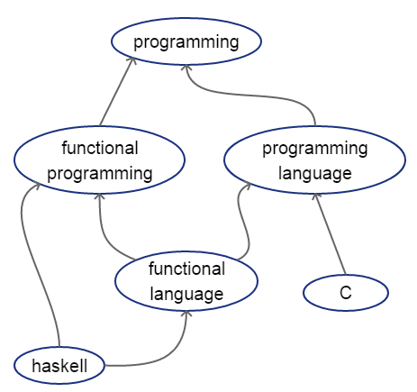

# bookmarkext
Browser extension of bookmark system.

This extensions allows to assign tags to tags themselves.
For example, it is possible to create the following hierarchy of tags:

If a bookmarks is created and e.g. tag "haskell" is assigned to it, then it will automatically have "programming", "functional programming", "programming language" and "functional language" tags.

## SQL migrations
[Flyway](https://flywaydb.org/) is used for migrations.
First, create the database manually:
```sql
DROP DATABASE IF EXISTS bm;
CREATE DATABASE bm;
```
Edit `backend/sql/flyway.conf`. (If you are going to run DB unit tests, then stop at this point and install [plpgunit](https://github.com/mixerp/plpgunit) first.) Apply migrations. That's it.

## DB unit tests
[plpgunit](https://github.com/mixerp/plpgunit) is used to unit test the sql functions.
To run the tests:
- install plpgunit
- make sure test migrations from `backend/sql/tests` are applied
- execute
```sql
BEGIN TRANSACTION;
SELECT * FROM unit_tests.begin();
ROLLBACK TRANSACTION;
```
