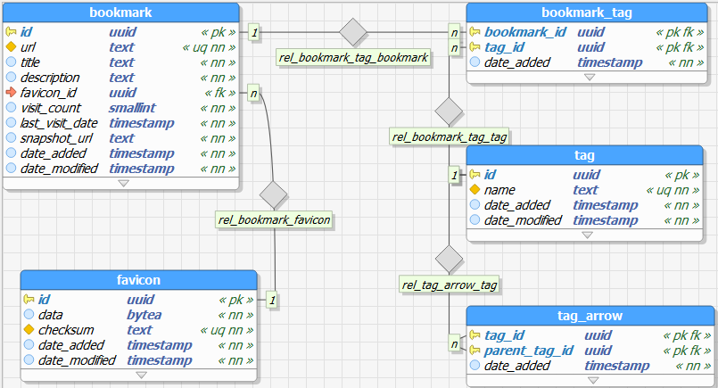
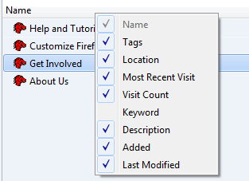

# General idea and requirements

- Tags.
- Tag inheritance. Multiple inheritance must be supported, i.e., for example, "J.S.Bach" tag is a descendant of "music" tag as well as of "people" tag; "php" tag is a descendant of "programming language" tag as well as "зашквар" tag.
- Three will be no folders because we will use tags instead.
- Filtering by multiple tags.
- Saving the snapshot of the page when a bookmark is added.
- Searching by title, description, and at the same time it must be possible to filer by tags.
- Sorting by every possible filed. Moreover, it must support sorting by multiple fields.
- Displaying tags as directories in a file system; possibility to see all parents of an opened tag somewhere in a status bar or somehow else; possibility to see how many bookmarks a tag have; possibility to just see all bookmarks (flat mode.)
- Synchronizing bookmarks between multiple different browsers.
- Importing bookmarks from firefox.

# Purpose

- Improve user experience of working with bookmarks in a web browser.
- Better learn some technologies and programming languages: WebExtenstions, WebSockets, PostgreSQL, Haskell.

# Model



# API

We will use websockets and [json-rpc 2.0](http://www.jsonrpc.org/specification).

todo: rewrite everything in this section using json-rpc.

## Create bookmark

Request example:
```json
{
  "jsonrpc": "2.0",
  "method": "CreateBookmark",
  "params": {
    "url": "https://example.com/",
    "title": "Example",
    "description": "example",
    "visit_date": 123123123,
    "visit_count": 1,
    "tags": ["tag1", "tag2"]
  },
  "id": 123
}
```
How it will work:
- check that `url` is present and it is a valid url
- check that `title` and at least one tag are present
- check that there is no bookmark with the same name yet
- insert the bookmark into `bookmark` table
- insert nonexistent tags into `tag` table
- for this bookmark, insert all tags into `bookmark_tag` table
- start a background async task that for each tag finds all its parents, grandparents and so on and inserts them into `bookmark_tag` table.  
It is assumed and expected that "tags" array already contains all of them, but we should check it anyway.
- give `id` of the bookmark to a service that will asynchronously take a snapshot of the page and update `snapshot_url` of the bookmark
- give `id` and `url` of the bookmark to a service that will asynchronously get (or find already exising) favicon and update `favicon_id` of the bookmark
- return `id`

Note: use [HistoryItem](https://developer.mozilla.org/en-US/Add-ons/WebExtensions/API/history/HistoryItem) to get `last_visit_date` and `visit_count`.

## Get all root tags

Root tags are tags that have no parents in `tag_arrow` table.

```json
{
  "jsonrpc": "2.0",
  "method": "GetRootTags",
  "params": {
    "skip": 1150,
    "take": 50,
    "sort": [
      { "name": "asc"},
      { "date_added": "desc" }
    ]
  },
  "id": 10
}
```

## Get all children of the tag
```json
{
  "jsonrpc": "2.0",
  "method": "GetChildTags",
  "params": ["<tag_id>"],
  "id": 11
}
```

## Get all parent tags of the tag
Upd: This method probably won't be needed.
```json
{
  "jsonrpc": "2.0",
  "method": "GetParentTags",
  "params": ["<tag_id>"],
  "id": 12
}
```

## Get all bookmarks of the tag
```json
{
  "jsonrpc": "2.0",
  "method": "GetBookmarksOfTag",
  "params": ["<tag_id>"],
  "id": 13
}
```

## Get all root bookmarks
Root bookmarks are ones that have no tags.
```json
{
  "jsonrpc": "2.0",
  "method": "GetRootBookmarks",
  "id": 14
}
```
Note: At this point we have enough API to navigate like in a file system. The implementation of the requests is obvious.

## Get all bookmarks
```json
{
  "jsonrpc": "2.0",
  "method": "GetBookmarks",
  "id": 14
}
```
Note: it will be used for the flat mode.

## Get tag's ascendants
Ascendant tags of a tag are its parents, grandparents and so on.
```json
{
  "jsonrpc": "2.0",
  "method": "GetAscendantTags",
  "params": ["<tag_id>"],
  "id": 15
}
```
Note: thid method will be used for the tag combobox.

## Create a new parent-child relation between tags
```json
{
  "jsonrpc": "2.0",
  "method": "SetParentTag",
  "params": {
    "tagId": "<tag_id>",
    "parentTagId": "<parent_tag_id>"
  },
  "id": 16
}
```
How it will work:
- we have to avoid creating a cycle in the graph - [Directed cycle graph](https://en.wikipedia.org/wiki/Cycle_graph#Directed_cycle_graph) i.e. we need to check that we do not add a cycle. As a result it will be [Directed acyclic graph](https://en.wikipedia.org/wiki/Directed_acyclic_graph)
- add the record into `tag_arrow` table
- add the records into `bookmark_tag` table, i.e. for each bookmark if it has `tagId` tag, then add also `parentTagId` tag and its ascendants

Note: This method will be used when a tag is copied and pasted into a new parent tag.

## Remove parent-child relation between tags
```json
{
  "jsonrpc": "2.0",
  "method": "UnsetParentTag",
  "params": {
    "tagId": "<tag_id>",
    "parentTagId": "<parent_tag_id>"
  },
  "id": 17
}
```
- delete the record from `tag_arrow` table
- delete from `bookmark_tag` table all records where `bookmark_id` is any of `tagId`'s bookmarks and `tag_id` is `parentTagId` or any of its ascendants. (But do not untag other parents of `tagId`!)

Note: this method will be used when a tag is unset from one of its parents, i.e. in the hierarchy mode.

## Change some tag's parent to another
```json
{
  "jsonrpc": "2.0",
  "method": "ResetParentTag",
  "params": {
    "tagId": "<tag_id>",
    "oldParentTagId": "<old_parent_tag_id>",
    "newParentTagId": "<new_parent_tag_id>"
  },
  "id": 16
}
```
- compose `UnsetParentTag(tagId, oldParentTagId)` and `SetParentTag(tagId, newParentTagId)`

Note: this method will be used when a tag is cut and pasted into a new parent tag.

## Create a root tag
```json
{
  "jsonrpc": "2.0",
  "method": "CreateRootTag",
  "params": { "name": "tag's name" },
  "id": 1
}
```
- just insert a new record into `tag` table.

## Create a tag inside another
```json
{
  "jsonrpc": "2.0",
  "method": "CreateTag",
  "params": {
    "name": "tag's name",
    "parentTag": "<parent_tag_id>"
  },
  "id": 2
}
```
- insert a new record into `tag` table
- insert a new record into `tag_arrow` table

## Delete bookmark
```json
{
  "jsonrpc": "2.0",
  "method": "DeleteBookmark",
  "params": ["<bookmark_id>"],
  "id": 2
}
```
- delete records from `bookmark_tag` table where `bookmark_id = "<bookmark_id>"`
- delete the record from `bookmark` table

## Delete tag
```json
{
  "jsonrpc": "2.0",
  "method": "DeleteTag",
  "params": ["<tag_id>"],
  "id": 2
}
```
- delete all parent tags of the tag
- delete all records from `bookmark_tag` table where `tag_id = "<tag_id>"`
- delete all bookmarks of the tag

## Edit bookmark
```json
{
  "jsonrpc": "2.0",
  "method": "EditBookmark",
  "params": {
    "bookmarkId": "<id>",
    "url": "https://example.com/",
    "title": "Example",
    "description": "example",
    "tags": ["tag1", "tag2"]
  },
  "id": 3
}
```
- if `url` is present, check if it is valid
- if `tags` is present, delete from `bookmark_tag` records where `bookmark_id = {id}` and add all tags from `tags` field the same way we do it when a bookmark is being created
- update the fields of the record in `bookmark` table

## Update bookmark's visit info

I hope it is possible for web extensions to specify some function that will be called every time a url is visited.  
Upd: it is definitely possible, use [onVisited](https://developer.mozilla.org/en-US/Add-ons/WebExtensions/API/history/onVisited).
```json
{
  "jsonrpc": "2.0",
  "method": "UpdateVisitInfo",
  "params": {
    "url": "https://example.com/",
    "last_visit_date": 123123123,
    "visit_count": 42
  },
  "id": 3
}
```
- check that `url` is present
- check that `last_visit_date` is present and it is a valid timestamp, and it is not older that one minute from now
- find the bookmark with such `url`
- update bookmark's `last_visit_date` and `visit_count`

## Sort

Sort by multiple fields:
```js
{
  "jsonrpc": "2.0",
  "method": "<method_that_returns_collection>",
  "params": {
    // ... method params
    "sort": [
      {
        "<column_name>": "asc" // or "desc"
      },
      // ... other columns
    ]
  },
  "id": 3
}
```
It should work for all methods that return collections.  
Example:
```json
{
  "jsonrpc": "2.0",
  "method": "GetBookmarksOfTag",
  "params": {
    "tagId": "<tag_id>",
    "sort": [
      { "date_added": "desc" },
      { "visit_count": "asc" }
    ]
  },
  "id": 13
}
```

## Offset and limit for lists

For list requests, it must be possible to pass "skip" and "take" parameters (as numbers of course).

## Search

todo: describe how searching/filtering will work

поиск:  
- по нескольким тегам  
- по тексту в тайтле  
- я еще не подумал про bulk delete букмарков/тегов
  и про балк копи\кат анд пейст

# UI

The view is split into three parts: tags tree, tags grid, bookmarks grid.

## Flat mode / bookmarks grid

This view looks pretty much the same as in firefox.

We show a grid of all bookmarks with columns "Name", "Tags", "Url", "Descrption", "Added", "Most Recent Visit", "Last Modified", "Visit Count", "Snapshot". "Name" contains titles. Before each title the favicon is shown.

The grid is virtualized, i.e. it shows the limited amount of bookmarks and loads more when a user has scrolled to the bottom.

"Tags" contains comma-separated list of all tags of the bookmark. "Snapshot" contains the link to the snapshot of the page.

It must be possible to hide/show columns the same way as in firefox:  


Except column names are different. By default columns "Most Recent Visit", "Last Modified", "Visit Count" are hidden.

When a bookmark is dbl-clicked, we open it in the current tab. When it is right-clicked, we show a context menu with the same options as in firefox.

It must be possible to rearrange columns.

Grid can be ordered by each column in desc/asc order. By default it is ordered by "Added" desc. It must be possible to order by multiple columns. In this case columns for ordering are taken from left to right and if the columns are rearranged, it affects ordering.

The state of the grid must be persistent. It includes columns visibility, arrangement and ordering.

When a bookmark is selected, it shows a form at the bottom. The form has the following fields (single line): "Name", "Url" and "Tags". But there must be button "More" below that adds "Descrption" field (multi-line).

"Tags" field is a multiselect combobox. There must be a button on the right side which opens the list of all tags sorted by name (it must be virtualized, i.e. only a limited amount of items is loaded and it loads more on scrolling). When a user begins to type a tag name (at least one symbol is entered), the (virtualized) list of all tags that starts with this text is shows.

After a tag has been added, its parents (and grandparents and so on) are loaded and they must be shown below the combobox as "_derived:_ ptag1, ptag2, ptag3".

Tags that are already added must be excluded from the suggestion list. Derived tags also must be excluded.

## Tags grid
It is a grid that lists tags. Columns are "Name", "Tags" and "Added". "Name" is the name of the tag and there should be the same icon before each tag name. "Tags" contains all parent tags of the tag.

The grid is sorted by "Name" by default.
Sorting functionality is the same as in the bookmarks grid. 
Also there is the same show/hide feature. "Added" is hidden by default.

This grid also loads more items on srolling.

At the root level, the grid contains all root tags. 
If a tag is dbl-clicked, it shows all its children tags and all bookmarks that have this tag.

If a tag is right-clicked, it shows a context menu with the following options: "**Open**", "Open all in tabs", "New Tag", "New Bookmark", "Cut", "Copy" (disabled for root tags), "Paste", "Unset" (disabled for root tags), "Delete".

If a tag is copied and pasted somewhere, it will set a new parent tag for it and all its bookmarks will have this parent tag.

A root tag cannot be copied and pasted into another tag. It can only be moved (cut & pasted).

If a tag is cut and pasted somewhere, it will no longer have its old parent and so its bookmarks.

"Unset" means that the relation between the tag and the parent tag will be removed.

"Delete" means that the tag will be completely deleted and all its bookmarks will be deleted. So it will propably make sense to show some confirmation popup to prevent accidental deletion of many bookmarks.

For tags, the editing form have only "Name" and "Tags" fields. "Tags" field must work the same way as "Tags" field for bookamarks.

## Hierarchy mode

It is a grid that lists tags and bookmarks. Columns are the same as in the flat mode.
Tags here are like directories in a file system. For tags, values in columns "Url", "Descrption", "Most Recent Visit", "Visit Count", "Snapshot" are empty; "Name" is the name of a tag and there should be the same icon before each tag name; "Tags" contains all parent tags of the tag.

Tags are always grouped, i.e. the grid is always sorted by the type of entity first. Sorting functionality is the same as in the flat mode.
Also there is the same show/hide feature. Click/dbl-click/rigt-click on a bookmark also works the same.

This grid also loads more items on srolling.

At the root level, the grid contains all root tags and all not tagged bookmarks. 

In case of a bookmark, "Unset" means that it will no longer have the tag.

In case of a bookmark, "Delete" means that it will be completely deleted.

Editing of bookmarks must work the same way as in the flat mode, except that if a current tag is removed for the bookmark, it must disappear from the grid after selecting a tag or another bookmark in the grid.

## Tags tree

There will be a tree of tags on the left. The first node will be "flat mode" and has no child nodes. When it is clicked, the user see the flat mode. The second node will be "root". When it is clicked the user see the hierarchy mode at the root level.

The child nodes of "root" are the root tags. The child nodes of root tags are thier child tags and so on, you got the idea.

Be default, "root" node is expanded.

When a tag is clicked in the tree, the user sees the hierarchy mode at the level of this tag.

The separation line between the tree and a grid must be adjustable horizontally.

